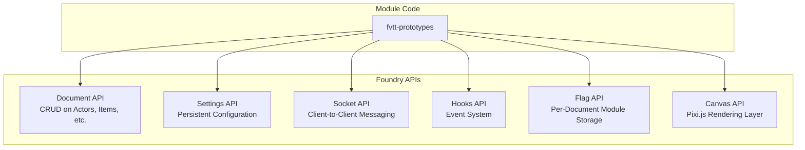

# API: Foundry API Reference

> Document API, Settings API, Socket API, and Hook API — the core interfaces modules use to interact with Foundry VTT.

## API Surface Overview



## Document API

Foundry's core data layer. All persistent entities (Actors, Items, Scenes, JournalEntries, etc.) are Documents.

### CRUD Operations

| Operation | Method | Returns |
|-----------|--------|---------|
| Create | `DocumentClass.create(data)` | `Promise<Document>` |
| Read | `game.actors.get(id)` | `Document \| undefined` |
| Update | `document.update(changes)` | `Promise<Document>` |
| Delete | `document.delete()` | `Promise<Document>` |
| Bulk Create | `DocumentClass.createDocuments([...data])` | `Promise<Document[]>` |
| Bulk Update | `DocumentClass.updateDocuments([...changes])` | `Promise<Document[]>` |
| Bulk Delete | `DocumentClass.deleteDocuments([...ids])` | `Promise<string[]>` |

### Document Collections

```js
// Access world-level document collections
game.actors    // All Actor documents
game.items     // All Item documents
game.scenes    // All Scene documents
game.journal   // All JournalEntry documents
game.tables    // All RollTable documents
game.macros    // All Macro documents
game.playlists // All Playlist documents
game.users     // All User documents
game.messages  // All ChatMessage documents
```

### Creating Documents

```js
// Create a new Actor
const actor = await Actor.create({
  name: 'Prototype NPC',
  type: 'npc',
  img: 'icons/svg/mystery-man.svg',
  system: {
    attributes: { hp: { value: 10, max: 10 } }
  }
});

// Create with module flags pre-set
const item = await Item.create({
  name: 'Prototype Item',
  type: 'weapon',
  flags: {
    'fvtt-prototypes': {
      prototypeData: { variant: 'alpha', version: 1 }
    }
  }
});
```

### Updating Documents

```js
// Single field update
await actor.update({ name: 'Updated Name' });

// Nested system data update (dot notation)
await actor.update({ 'system.attributes.hp.value': 5 });

// Multiple fields
await actor.update({
  name: 'Renamed Actor',
  img: 'icons/svg/skull.svg',
  'system.attributes.hp.value': 0
});
```

## Flag API

Module-scoped key-value storage on any Document. Flags persist across sessions and sync across clients.

| Method | Signature | Description |
|--------|-----------|-------------|
| Get | `doc.getFlag(scope, key)` | Returns the flag value or `undefined` |
| Set | `doc.setFlag(scope, key, value)` | Sets flag, triggers document update |
| Unset | `doc.unsetFlag(scope, key)` | Removes the flag entirely |

```js
// Store structured data
await actor.setFlag('fvtt-prototypes', 'prototypeData', {
  variant: 'beta',
  iterations: 3,
  lastModified: Date.now()
});

// Read it back
const data = actor.getFlag('fvtt-prototypes', 'prototypeData');
// { variant: 'beta', iterations: 3, lastModified: 1708200000000 }

// Remove a flag
await actor.unsetFlag('fvtt-prototypes', 'prototypeData');
```

## Settings API

Persistent module configuration stored at world or client scope.

### Registration

```js
// World-scoped setting (GM only, shared across all clients)
game.settings.register('fvtt-prototypes', 'enableFeature', {
  name: 'FVTT_PROTOTYPES.Settings.EnableFeature',
  hint: 'FVTT_PROTOTYPES.Settings.EnableFeatureHint',
  scope: 'world',
  config: true,
  type: Boolean,
  default: false,
  requiresReload: false,
  onChange: (value) => {
    console.log('fvtt-prototypes | Feature toggled:', value);
  }
});

// Client-scoped setting (per-user, stored locally)
game.settings.register('fvtt-prototypes', 'sidebarPosition', {
  name: 'Sidebar Position',
  scope: 'client',
  config: false,        // Hidden from settings UI
  type: String,
  default: 'right'
});
```

### Settings Menu (Complex Configuration)

```js
game.settings.registerMenu('fvtt-prototypes', 'configMenu', {
  name: 'FVTT_PROTOTYPES.Settings.ConfigMenu',
  label: 'FVTT_PROTOTYPES.Settings.ConfigMenuLabel',
  icon: 'fas fa-cogs',
  type: PrototypeConfigApp,   // ApplicationV2 subclass
  restricted: true             // GM only
});
```

## Socket API

Real-time client-to-client messaging. All connected clients receive socket messages.

```js
// Emit to all other clients
game.socket.emit('module.fvtt-prototypes', {
  action: 'syncState',
  payload: { actorId: actor.id, state: newState },
  userId: game.user.id
});

// Listen for messages
game.socket.on('module.fvtt-prototypes', (data) => {
  if (data.userId === game.user.id) return; // Ignore own messages
  switch (data.action) {
    case 'syncState':
      handleSyncState(data.payload);
      break;
    case 'requestData':
      handleDataRequest(data.payload);
      break;
  }
});
```

## Hooks API

Event system for intercepting Foundry lifecycle events and document changes.

| Pattern | Usage | When |
|---------|-------|------|
| `Hooks.on(name, fn)` | Persistent listener | Render hooks, document changes |
| `Hooks.once(name, fn)` | One-shot listener | Initialization, one-time setup |
| `Hooks.call(name, ...args)` | Synchronous, cancellable | Custom module hooks |
| `Hooks.callAll(name, ...args)` | Synchronous, not cancellable | Notification hooks |

### Common Hooks

```js
// Document lifecycle
Hooks.on('preCreateActor', (document, data, options, userId) => { });
Hooks.on('createActor', (document, options, userId) => { });
Hooks.on('preUpdateActor', (document, changes, options, userId) => { });
Hooks.on('updateActor', (document, changes, options, userId) => { });
Hooks.on('preDeleteActor', (document, options, userId) => { });
Hooks.on('deleteActor', (document, options, userId) => { });

// Application rendering
Hooks.on('renderActorSheet', (app, html, data) => { });
Hooks.on('renderItemSheet', (app, html, data) => { });
Hooks.on('renderChatMessage', (app, html, data) => { });

// Canvas
Hooks.on('canvasReady', (canvas) => { });
Hooks.on('updateToken', (document, changes, options, userId) => { });
```

## Rate Limits & Performance

| API | Constraint | Recommendation |
|-----|-----------|----------------|
| Document updates | ~50 updates/sec before lag | Batch with `updateDocuments()` |
| Socket messages | No hard limit, but broadcast to all | Throttle to 10/sec max |
| Settings changes | Triggers reload if `requiresReload` | Debounce rapid changes |
| Flag updates | Each is a full document update | Batch related flag changes |

## Decision History & Trade-offs

### Flags vs. Custom Document Types

**Chosen**: Flags for module-specific data storage.
**Why**: Flags require no system modification and work on any document type. Custom document types require cooperation from the game system and are significantly more complex.
**Trade-off**: Flags are untyped and lack schema validation by default. Mitigate with DataModel-backed flag schemas (see `database/models.md`).

### Socket API vs. SocketLib

**Chosen**: Native socket API as default, SocketLib as optional enhancement.
**Why**: The native API has zero dependencies. SocketLib adds convenience (targeted messages, GM-execution) but adds a module dependency.
**Trade-off**: Native sockets broadcast to all clients — targeted messaging requires manual filtering. Add SocketLib when per-user messaging becomes a requirement.

## Related Documents

| Document | Relevance |
|----------|-----------|
| [headers.md](headers.md) | Module manifest that declares API access |
| [examples.md](examples.md) | Practical code using these APIs |
| [../database/models.md](../database/models.md) | DataModel schemas for flag validation |
| [../auth/integration.md](../auth/integration.md) | Permission checks before API calls |
