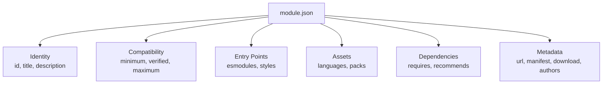

# API: Module Manifest & Configuration

> Module manifest (`module.json`) structure, metadata fields, compatibility declarations, and manifest conventions.

## Manifest Overview

The `module.json` file is the single source of truth for how Foundry VTT loads and presents the module. It declares identity, compatibility, entry points, assets, and dependencies.



## Complete Manifest Reference

```json
{
  "id": "fvtt-prototypes",
  "title": "FVTT Prototypes",
  "description": "A Foundry VTT module for prototyping and experimenting with custom functionality.",
  "version": "1.0.0",
  "compatibility": {
    "minimum": "12",
    "verified": "12",
    "maximum": "13"
  },
  "authors": [
    {
      "name": "Your Name",
      "url": "https://github.com/your-username",
      "discord": "username#0000"
    }
  ],
  "esmodules": [
    "scripts/main.js"
  ],
  "styles": [
    "styles/module.css"
  ],
  "languages": [
    {
      "lang": "en",
      "name": "English",
      "path": "languages/en.json"
    }
  ],
  "relationships": {
    "requires": [],
    "recommends": []
  },
  "socket": true,
  "url": "https://github.com/your-username/fvtt-prototypes",
  "manifest": "https://github.com/your-username/fvtt-prototypes/releases/latest/download/module.json",
  "download": "https://github.com/your-username/fvtt-prototypes/releases/download/v1.0.0/module.zip",
  "readme": "https://github.com/your-username/fvtt-prototypes/blob/main/README.md",
  "changelog": "https://github.com/your-username/fvtt-prototypes/blob/main/CHANGELOG.md",
  "bugs": "https://github.com/your-username/fvtt-prototypes/issues"
}
```

## Field Reference

### Identity Fields

| Field | Required | Description |
|-------|----------|-------------|
| `id` | Yes | Unique module identifier. Must match the module directory name. Use lowercase with hyphens. |
| `title` | Yes | Human-readable display name shown in Foundry's module manager. |
| `description` | Yes | Short description displayed in the module browser. Supports basic HTML. |
| `version` | Yes | Semantic version string (`MAJOR.MINOR.PATCH`). |

### Compatibility

```json
{
  "compatibility": {
    "minimum": "12",
    "verified": "12",
    "maximum": "13"
  }
}
```

| Field | Meaning |
|-------|---------|
| `minimum` | Oldest Foundry version the module works with. Users on older versions cannot install it. |
| `verified` | The version you have tested against. Foundry shows a green checkmark. |
| `maximum` | Highest version supported. Foundry warns users above this version. Omit to allow future versions. |

### Entry Points

| Field | Type | Description |
|-------|------|-------------|
| `esmodules` | `string[]` | JavaScript files loaded as ES modules during `init`. |
| `styles` | `string[]` | CSS files injected into the document head. |
| `scripts` | `string[]` | Legacy scripts loaded as global `<script>` tags. **Prefer `esmodules`.** |

### Socket Declaration

```json
{
  "socket": true
}
```

Setting `socket: true` enables `game.socket.emit('module.fvtt-prototypes', ...)`. Without this, socket calls are silently ignored.

### Language Packs

```json
{
  "languages": [
    {
      "lang": "en",
      "name": "English",
      "path": "languages/en.json"
    },
    {
      "lang": "es",
      "name": "Español",
      "path": "languages/es.json"
    }
  ]
}
```

Localization strings are accessed via `game.i18n.localize('FVTT_PROTOTYPES.Key')` or `game.i18n.format('FVTT_PROTOTYPES.Key', { name })`.

### Relationships (Dependencies)

```json
{
  "relationships": {
    "requires": [
      {
        "id": "lib-wrapper",
        "type": "module",
        "compatibility": { "minimum": "1.12.0.0" }
      }
    ],
    "recommends": [
      {
        "id": "socketlib",
        "type": "module"
      }
    ],
    "systems": [
      {
        "id": "dnd5e",
        "type": "system",
        "compatibility": { "minimum": "3.0.0" }
      }
    ]
  }
}
```

| Relationship | Behavior |
|-------------|----------|
| `requires` | Module cannot activate without these. Foundry enforces this. |
| `recommends` | Informational. Shown to user but not enforced. |
| `systems` | Limits module to specific game systems. Omit for system-agnostic modules. |

## Manifest Versioning Strategy

Update the manifest version following semver:

| Change Type | Version Bump | Example |
|------------|-------------|---------|
| Breaking API changes | Major | `1.0.0` → `2.0.0` |
| New features, backward compatible | Minor | `1.0.0` → `1.1.0` |
| Bug fixes | Patch | `1.0.0` → `1.0.1` |
| Foundry compatibility update only | Patch | `1.0.0` → `1.0.1` |

## Manifest Validation

Foundry validates the manifest on load. Common errors:

| Error | Cause | Fix |
|-------|-------|-----|
| "Module not found" | `id` doesn't match directory name | Rename directory or `id` |
| "Compatibility warning" | `verified` is lower than current Foundry | Update `verified` field |
| "Script not found" | Path in `esmodules` doesn't exist | Check file path and casing |
| "Socket not enabled" | `socket: true` missing | Add `"socket": true` to manifest |

## Decision History & Trade-offs

### esmodules vs. scripts

**Chosen**: `esmodules` exclusively.
**Why**: ES modules provide proper scoping, avoid global namespace pollution, and enable `import`/`export`. The `scripts` field loads as global `<script>` tags — a legacy pattern.
**Trade-off**: ES modules cannot be accessed from the browser console by default. Expose a public API via `game.modules.get('fvtt-prototypes').api` when debugging access is needed.

### System-Agnostic vs. System-Specific

**Chosen**: System-agnostic (no `systems` relationship).
**Why**: Prototyping module should work across game systems. System-specific features should guard behind runtime checks rather than manifest restrictions.
**Trade-off**: Must handle varying `system` data structures at runtime. Use `game.system.id` checks for system-specific code paths.

## Related Documents

| Document | Relevance |
|----------|-----------|
| [endpoints.md](endpoints.md) | APIs the manifest enables access to |
| [examples.md](examples.md) | Using APIs declared in the manifest |
| [../architecture/dependencies.md](../architecture/dependencies.md) | Module dependencies and npm packages |
| [../seo/overview.md](../seo/overview.md) | Module discoverability via manifest metadata |
