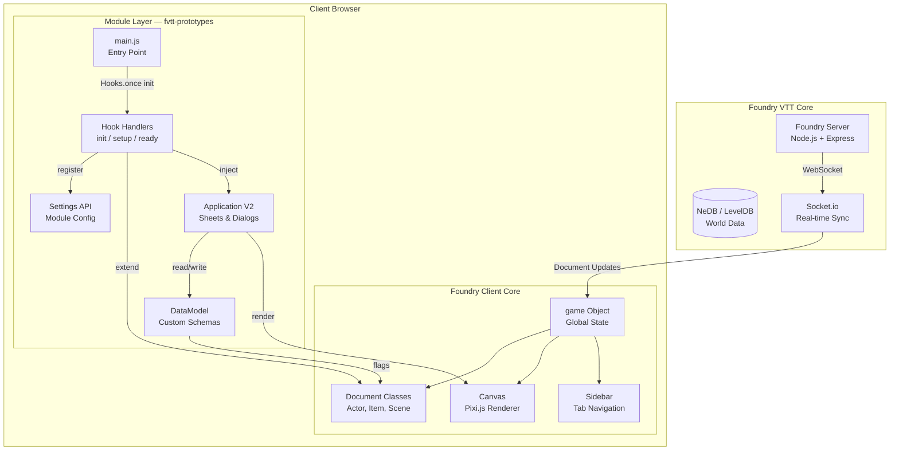
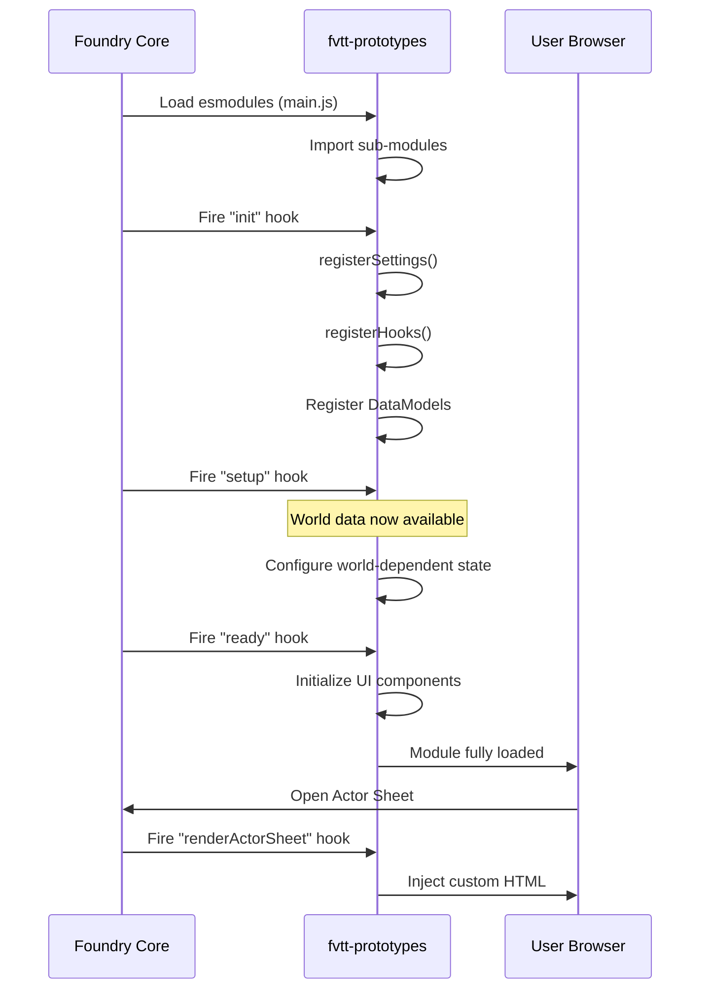
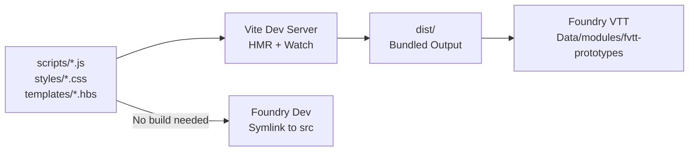

# Architecture: System Overview

> Module architecture, lifecycle hooks, layer boundaries, and system design.

## Architecture Diagram



## Architectural Layers

### 1. Entry Layer (`scripts/main.js`)

The single entry point registered in `module.json`. Responsible only for importing sub-modules and registering top-level hooks. No business logic lives here.

```js
// scripts/main.js
import { registerSettings } from './settings.js';
import { registerHooks } from './hooks/index.js';

Hooks.once('init', () => {
  console.log('fvtt-prototypes | Initializing module');
  registerSettings();
  registerHooks();
});
```

### 2. Hook Layer (`scripts/hooks/`)

Handlers organized by lifecycle phase. Each file exports functions that are registered during `init` and invoked by Foundry at the appropriate time.

```js
// scripts/hooks/index.js
import { onReady } from './ready.js';
import { onRenderActorSheet } from './render-actor-sheet.js';

export function registerHooks() {
  Hooks.once('ready', onReady);
  Hooks.on('renderActorSheet', onRenderActorSheet);
}
```

### 3. Application Layer (`scripts/apps/`)

UI components extending `foundry.applications.api.ApplicationV2` (V12+) or `Application` (legacy). Each application class pairs with a Handlebars template in `templates/`.

### 4. Data Layer (`scripts/models/`)

Custom `DataModel` subclasses that define schemas for flags or custom document types. Validation and defaults are declared here.

## Module Lifecycle — Detailed



### Hook Execution Order

| Phase | Hook | Safe To Do | Not Safe Yet |
|-------|------|-----------|-------------|
| 1 | `init` | Register settings, models, sheets | Access `game.actors`, world data |
| 2 | `setup` | Read world config, register based on system | Render UI, access canvas |
| 3 | `ready` | All operations, UI, canvas, documents | N/A — everything is available |
| 4 | `render*` | Modify rendered HTML, inject controls | Change data (causes re-render loop) |

## Build Pipeline



Two development modes:

- **Symlink mode** (no build): Symlink `scripts/` directly into Foundry's modules directory. Foundry loads ES modules natively.
- **Vite mode** (bundled): Vite bundles and outputs to `dist/`. Use this when importing npm packages or TypeScript.

## Performance Considerations

- **Hook registration**: Use `Hooks.once()` for one-time setup to avoid repeated execution.
- **Render hooks**: Keep render hook callbacks fast (< 5ms). Defer heavy DOM manipulation with `requestAnimationFrame`.
- **Socket messages**: Minimize payload size. Foundry broadcasts to all clients — large payloads degrade performance for every connected user.
- **Canvas operations**: Batch Pixi.js draw calls. Use `canvas.app.renderer.render()` only when necessary.

## Decision History & Trade-offs

### Hook-Driven Architecture vs. Class Inheritance

**Chosen**: Hook-driven composition.
**Why**: Foundry's extension model is hook-based. Modules cannot subclass core classes directly — they intercept lifecycle events and inject behavior. This is not a choice but a platform constraint.
**Trade-off**: Less control over execution order between modules. Use hook priorities (numeric parameter) when ordering matters.

### ES Modules vs. Global Scripts

**Chosen**: ES modules (`esmodules` in manifest).
**Why**: Provides proper scoping, avoids global namespace pollution, enables `import`/`export` for code organization.
**Trade-off**: Slightly more complex debugging (module scope in browser DevTools), but the isolation benefits far outweigh this.

### Vite vs. No Build Step

**Chosen**: Vite as optional build tool.
**Why**: Enables TypeScript support, npm package imports, and HMR during development. Falls back to native ES modules for simplicity when no build is needed.
**Trade-off**: Adds a build step and `node_modules`. For pure JS prototyping, symlink mode avoids this complexity entirely.

## Related Documents

| Document | Relevance |
|----------|-----------|
| [dependencies.md](dependencies.md) | Vite config, Foundry VTT Types, npm packages |
| [patterns.md](patterns.md) | Code conventions, error handling, design patterns |
| [../api/endpoints.md](../api/endpoints.md) | Available Foundry APIs for each layer |
| [../database/schema.md](../database/schema.md) | Data model architecture and schemas |
