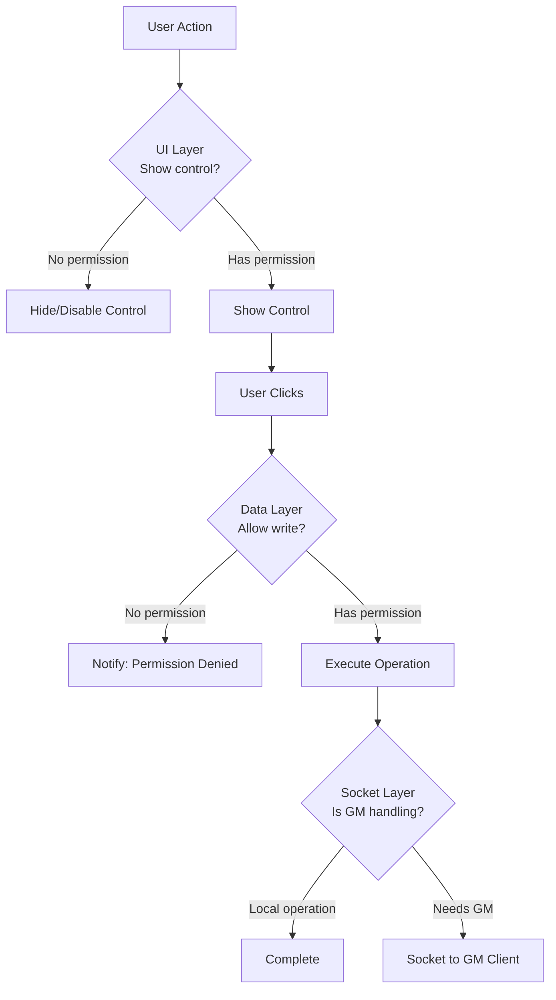

# Auth: Permission Integration Patterns

> Practical patterns for implementing permission checks throughout module code — UI gating, data validation, and socket authorization.

## Permission Check Flow



## UI Layer: Conditional Rendering

### In Handlebars Templates

```handlebars
{{!-- templates/config.hbs --}}
<div class="fvtt-prototypes--panel">
  {{!-- All users see read-only info --}}
  <div class="fvtt-prototypes--panel__info">
    <span>Variant: {{variant}}</span>
    <span>Iterations: {{iterations}}</span>
  </div>

  {{!-- Only owners see edit controls --}}
  {{#if isOwner}}
  <div class="fvtt-prototypes--panel__controls">
    <button class="fvtt-prototypes--edit-btn" type="button">
      <i class="fas fa-edit"></i>
      {{localize "FVTT_PROTOTYPES.Actions.Edit"}}
    </button>
  </div>
  {{/if}}

  {{!-- Only GMs see admin actions --}}
  {{#if isGM}}
  <div class="fvtt-prototypes--panel__admin">
    <button class="fvtt-prototypes--reset-btn" type="button">
      <i class="fas fa-undo"></i>
      {{localize "FVTT_PROTOTYPES.Actions.Reset"}}
    </button>
  </div>
  {{/if}}
</div>
```

### Providing Permission Context to Templates

```js
// In an ApplicationV2 class
async _prepareContext() {
  const actor = this.actor;
  return {
    variant: actor.getFlag('fvtt-prototypes', 'prototypeData')?.variant ?? '',
    iterations: actor.getFlag('fvtt-prototypes', 'prototypeData')?.iterations ?? 1,
    isOwner: actor.isOwner,
    isGM: game.user.isGM,
    canEdit: actor.testUserPermission(game.user, 'OWNER'),
    canView: actor.testUserPermission(game.user, 'OBSERVER')
  };
}
```

### In Sheet Injection Hooks

```js
// scripts/hooks/render-actor-sheet.js
export function onRenderActorSheet(app, html, data) {
  const actor = app.document;

  // Always inject the read-only display (for observers+)
  if (!actor.testUserPermission(game.user, 'LIMITED')) return;

  const protoData = actor.getFlag('fvtt-prototypes', 'prototypeData') ?? {};
  injectReadOnlyPanel(html, protoData);

  // Only add edit controls for owners
  if (actor.isOwner) {
    injectEditControls(html, actor, protoData);
  }

  // Only add admin controls for GMs
  if (game.user.isGM) {
    injectAdminControls(html, actor);
  }
}
```

## Data Layer: Pre-Write Validation

Always validate permissions before modifying documents, even if the UI should have prevented the action.

```js
// scripts/utils/permissions.js
import { MODULE_ID } from '../constants.js';

/**
 * Check if current user can modify prototype data on a document.
 * @param {Document} document - The target document
 * @returns {boolean}
 */
export function canEditPrototypeData(document) {
  // GM can always edit
  if (game.user.isGM) return true;

  // Check document ownership
  if (!document.isOwner) return false;

  // Check module-level feature access setting
  const requiredRole = game.settings.get(MODULE_ID, 'featureAccessLevel');
  return game.user.role >= requiredRole;
}

/**
 * Guard wrapper — call before any write operation.
 */
export function guardEdit(document, operationName) {
  if (!canEditPrototypeData(document)) {
    ui.notifications.warn(
      game.i18n.format('FVTT_PROTOTYPES.Errors.NoPermission', {
        operation: operationName,
        name: document.name
      })
    );
    return false;
  }
  return true;
}
```

### Using the Guard

```js
import { guardEdit } from '../utils/permissions.js';

async function updateVariant(actor, newVariant) {
  if (!guardEdit(actor, 'Update Variant')) return;

  await actor.setFlag('fvtt-prototypes', 'prototypeData.variant', newVariant);
  ui.notifications.info(`Updated variant to "${newVariant}".`);
}
```

## Socket Layer: GM-Delegated Operations

Some operations require GM-level access (e.g., modifying documents the player doesn't own). Use sockets to delegate to the GM client.

```js
// scripts/socket-actions/gm-update.js
import { MODULE_ID, SOCKET_NAME } from '../constants.js';
import { onSocket, emit } from '../socket.js';

// Register GM-side handler
export function registerGMUpdateHandler() {
  onSocket('gmUpdate', async ({ documentType, documentId, updates }, userId) => {
    if (!game.user.isGM) return; // Only GM processes this

    const collection = game[documentType === 'Actor' ? 'actors' : 'items'];
    const doc = collection.get(documentId);
    if (!doc) return;

    await doc.update(updates);
  });
}

// Client-side request function
export async function requestGMUpdate(document, updates) {
  if (game.user.isGM) {
    // GM can update directly
    return document.update(updates);
  }

  // Delegate to GM via socket
  emit('gmUpdate', {
    documentType: document.documentName,
    documentId: document.id,
    updates
  });
}
```

## Pre-Hooks for Permission Enforcement

Use Foundry's `pre` hooks to block unauthorized operations before they reach the server:

```js
// Prevent non-owners from modifying prototype flags
Hooks.on('preUpdateActor', (document, changes, options, userId) => {
  const flagPath = `flags.${MODULE_ID}`;

  // Check if this update touches our flags
  const touchesOurFlags = foundry.utils.hasProperty(changes, flagPath);
  if (!touchesOurFlags) return true; // Not our concern

  // Allow GM always
  const user = game.users.get(userId);
  if (user.isGM) return true;

  // Check ownership
  if (!document.testUserPermission(user, 'OWNER')) {
    ui.notifications.error('You do not have permission to modify prototype data.');
    return false; // Block the update
  }

  return true;
});
```

## Permission Caching

For UI that checks permissions frequently (e.g., token HUD buttons), cache the result per render cycle:

```js
const permissionCache = new Map();

function getCachedPermission(document) {
  const key = `${document.id}-${game.user.id}`;
  if (!permissionCache.has(key)) {
    permissionCache.set(key, canEditPrototypeData(document));
  }
  return permissionCache.get(key);
}

// Clear cache when ownership changes
Hooks.on('updateActor', (actor, changes) => {
  if ('ownership' in changes) {
    permissionCache.delete(`${actor.id}-${game.user.id}`);
  }
});
```

## Decision History & Trade-offs

### Three-Layer Permission Checks vs. Server-Only

**Chosen**: UI + Data + Socket validation.
**Why**: Defense in depth. UI checks improve UX (hide inaccessible actions). Data checks prevent bypasses via browser console. Socket checks prevent impersonation attacks.
**Trade-off**: Three validation points to maintain. Centralize logic in `utils/permissions.js` to keep it DRY.

### GM Delegation via Sockets vs. Custom API

**Chosen**: Socket-based GM delegation.
**Why**: No server-side code required. Foundry modules are client-side only — sockets are the only way to request privileged operations from another client.
**Trade-off**: Requires a GM client to be connected. If the GM disconnects, delegated operations fail silently. Add timeout handling for production features.

## Related Documents

| Document | Relevance |
|----------|-----------|
| [overview.md](overview.md) | Role and ownership fundamentals |
| [security.md](security.md) | Threat model these patterns defend against |
| [../api/endpoints.md](../api/endpoints.md) | APIs that require permission checks |
| [../ui/patterns.md](../ui/patterns.md) | UI patterns for permission-aware rendering |
