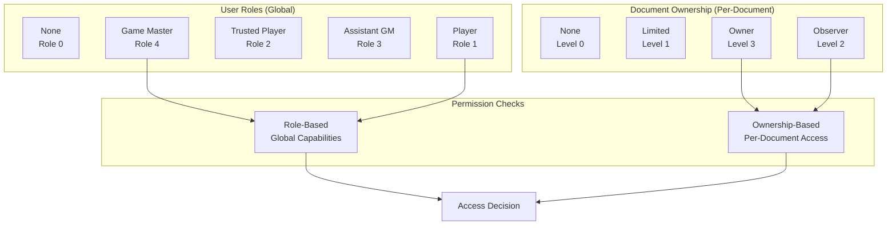

# Auth: Foundry Permission Model

> User roles, document ownership, permission levels, and how Foundry VTT controls access to data and features.

## Permission Architecture



## User Roles

Foundry defines a fixed hierarchy of user roles. Each role inherits all permissions from lower roles.

| Role | Level | Capabilities |
|------|-------|-------------|
| None | 0 | No access. Cannot join the game. |
| Player | 1 | Control owned tokens, edit owned documents, use chat |
| Trusted Player | 2 | Create documents (Actors, Items), upload files, use scripts |
| Assistant GM | 3 | Configure world settings, manage non-GM users, bypass most ownership |
| Game Master | 4 | Full access. Configure everything, manage all users, bypass all ownership |

### Checking User Role

```js
// Current user's role level
const role = game.user.role; // 0-4

// Named checks
game.user.isGM;       // true if role === 4 (or isGM flag)
game.user.isTrusted;  // true if role >= 2

// Check against specific role
const isAssistantOrHigher = game.user.role >= CONST.USER_ROLES.ASSISTANT;
```

## Document Ownership

Each document has an `ownership` object mapping user IDs to permission levels. This controls who can view/edit individual documents.

| Level | Name | Can View | Can Edit | Can Delete |
|-------|------|----------|----------|------------|
| -1 | Default | Inherits from `default` key | — | — |
| 0 | None | No | No | No |
| 1 | Limited | Partial (name, image only) | No | No |
| 2 | Observer | Full read | No | No |
| 3 | Owner | Full read | Yes | Yes |

### Ownership Object Structure

```json
{
  "_id": "actorId123",
  "name": "Player Character",
  "ownership": {
    "default": 0,
    "userId123": 3,
    "userId456": 2
  }
}
```

- `default`: Applies to any user not explicitly listed.
- `userId123: 3`: This user is Owner — can edit.
- `userId456: 2`: This user is Observer — read-only.

### Checking Ownership

```js
const actor = game.actors.get('actorId123');

// Check if current user has a specific permission level
actor.testUserPermission(game.user, 'OWNER');    // true/false
actor.testUserPermission(game.user, 'OBSERVER'); // true/false
actor.testUserPermission(game.user, 'LIMITED');  // true/false

// Check if current user can perform an action
actor.isOwner;  // true if user has OWNER level (or is GM)

// Numeric comparison
const level = actor.getUserLevel(game.user); // 0, 1, 2, or 3
```

## Permission Configuration

GMs configure per-role permissions in Foundry's "Configure Permissions" dialog. These are stored in `game.permissions`.

### Key Permission Settings

| Permission | Default | Description |
|-----------|---------|-------------|
| `ACTOR_CREATE` | Trusted+ | Create new Actor documents |
| `ITEM_CREATE` | Trusted+ | Create new Item documents |
| `JOURNAL_CREATE` | Trusted+ | Create journal entries |
| `MACRO_SCRIPT` | GM only | Execute JavaScript macros |
| `SETTINGS_MODIFY` | GM only | Change world-level settings |
| `TOKEN_CONFIGURE` | Owner+ | Configure token settings |
| `DRAWING_CREATE` | Trusted+ | Create canvas drawings |

### Checking Permissions Programmatically

```js
// Check if current user can create actors
const canCreate = game.permissions.ACTOR_CREATE.includes(game.user.role);

// Or use the Foundry helper
const canCreate = game.user.can('ACTOR_CREATE');
```

## Module-Level Access Control

Modules should layer their own feature access on top of Foundry's permission model.

### Settings-Based Feature Gating

```js
// Register a setting that controls who can use a module feature
game.settings.register('fvtt-prototypes', 'featureAccessLevel', {
  name: 'Feature Access Level',
  hint: 'Minimum role required to use prototype features.',
  scope: 'world',
  config: true,
  type: Number,
  choices: {
    1: 'Player',
    2: 'Trusted Player',
    3: 'Assistant GM',
    4: 'Game Master'
  },
  default: 2
});

// Check at runtime
function canUsePrototypeFeature() {
  const requiredRole = game.settings.get('fvtt-prototypes', 'featureAccessLevel');
  return game.user.role >= requiredRole;
}
```

### GM-Only Operations

```js
function requireGM(operationName) {
  if (!game.user.isGM) {
    ui.notifications.warn(
      game.i18n.format('FVTT_PROTOTYPES.Errors.GMOnly', { operation: operationName })
    );
    return false;
  }
  return true;
}

// Usage
async function resetAllPrototypeData() {
  if (!requireGM('Reset Prototype Data')) return;
  // ... proceed with GM-only operation
}
```

## Decision History & Trade-offs

### Relying on Foundry Roles vs. Custom Permission System

**Chosen**: Use Foundry's built-in roles and ownership model.
**Why**: Users already understand the role hierarchy. GMs configure it globally. Adding a custom permission layer would confuse users and duplicate existing functionality.
**Trade-off**: Limited granularity — only 4 role levels and 4 ownership levels. For fine-grained feature access, supplement with settings-based gating (see above).

### Ownership Check Timing

**Chosen**: Check permissions at the UI layer (before showing controls) and at the data layer (before writes).
**Why**: Defense in depth. UI checks provide good UX (don't show buttons users can't use). Data checks prevent bypasses via console/macros.
**Trade-off**: Duplicate checks in two places. Acceptable — the permission API calls are O(1) and negligible in cost.

## Related Documents

| Document | Relevance |
|----------|-----------|
| [integration.md](integration.md) | Implementing permission checks in module code |
| [security.md](security.md) | Security model and threat mitigation |
| [../api/endpoints.md](../api/endpoints.md) | API calls that require permission checks |
| [../database/migrations.md](../database/migrations.md) | Why migrations require GM role |
