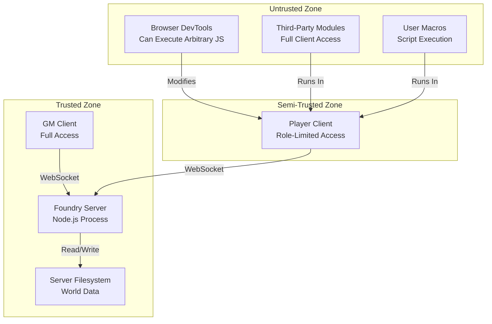

# Auth: Security Model & Threat Mitigation

> Security boundaries, threat model, and defensive coding practices for Foundry VTT modules.

## Trust Boundaries



## Threat Model

### Threat 1: Client-Side Privilege Escalation

**Risk**: Players can open browser DevTools and call any JavaScript API, bypassing UI restrictions.

**Mitigation**: Foundry's server validates document ownership on write operations. Modules cannot bypass this — the server rejects unauthorized updates. However, socket messages are not server-validated.

```js
// This will FAIL server-side for non-owners, even from DevTools:
await someActor.update({ name: 'Hacked' });
// Server returns: "You do not have permission to update this Actor"

// This will SUCCEED because sockets have no server-side validation:
game.socket.emit('module.fvtt-prototypes', { action: 'doEvil', ... });
// The GM client receives and processes this without verification!
```

**Defense**: Always validate the sender in socket handlers:

```js
onSocket('gmUpdate', async ({ documentId, updates }, userId) => {
  if (!game.user.isGM) return;

  // Validate the requesting user has appropriate permissions
  const requestingUser = game.users.get(userId);
  const document = game.actors.get(documentId);

  if (!document) return;
  if (!document.testUserPermission(requestingUser, 'OWNER')) {
    console.warn(`fvtt-prototypes | Rejected unauthorized socket request from ${requestingUser.name}`);
    return; // Deny the request
  }

  await document.update(updates);
});
```

### Threat 2: Cross-Site Scripting (XSS) via Flag Data

**Risk**: If module data contains HTML that gets rendered unsanitized, an attacker could inject malicious scripts via flag values.

**Mitigation**: Use Handlebars (auto-escapes by default) and Foundry's sanitization.

```handlebars
{{!-- SAFE: Handlebars auto-escapes --}}
<span>{{variant}}</span>

{{!-- DANGEROUS: Triple-braces disable escaping --}}
<span>{{{variant}}}</span>  {{!-- NEVER do this with user input --}}
```

```js
// If you must render HTML from user input, sanitize first:
const cleanHTML = TextEditor.enrichHTML(userInput, {
  async: false,
  secrets: false,
  documents: false,   // Don't resolve @UUID links from untrusted input
  rollData: {}
});
```

### Threat 3: Prototype Pollution via mergeObject

**Risk**: `foundry.utils.mergeObject()` can be exploited if the source object contains `__proto__` or `constructor` keys.

**Mitigation**: Foundry v12+ sanitizes prototype pollution by default. For explicit safety:

```js
// Safe — Foundry strips dangerous keys
foundry.utils.mergeObject(target, userInput, {
  recursive: true,
  performDeletions: false
});

// Extra safe — validate input shape first
function sanitizeInput(input) {
  const clean = {};
  const allowedKeys = ['variant', 'iterations', 'displayMode'];
  for (const key of allowedKeys) {
    if (key in input) clean[key] = input[key];
  }
  return clean;
}
```

### Threat 4: Macro Injection via Module APIs

**Risk**: If the module exposes a public API (`game.modules.get('fvtt-prototypes').api`), malicious macros can call it with crafted arguments.

**Mitigation**: Validate all public API inputs. Treat the public API as an external boundary.

```js
// Public API with input validation
game.modules.get(MODULE_ID).api = {
  setVariant: async (actorId, variant) => {
    if (typeof actorId !== 'string' || typeof variant !== 'string') {
      throw new Error('Invalid arguments: expected (string, string)');
    }
    if (variant.length > 100) {
      throw new Error('Variant name too long (max 100 characters)');
    }

    const actor = game.actors.get(actorId);
    if (!actor) throw new Error(`Actor not found: ${actorId}`);
    if (!actor.isOwner) throw new Error('Permission denied');

    await actor.setFlag(MODULE_ID, 'prototypeData.variant', variant);
  }
};
```

### Threat 5: Data Exfiltration via Socket Broadcast

**Risk**: Socket messages are broadcast to all connected clients. Sensitive data in socket payloads is visible to all players.

**Mitigation**: Never include sensitive data in socket messages. Send document IDs, not full document data.

```js
// BAD — broadcasts full actor data to all clients
emit('syncActor', { actorData: actor.toObject() });

// GOOD — send only the ID, let each client look it up with their own permission level
emit('syncActor', { actorId: actor.id });
```

## Security Checklist

When adding a new feature, verify:

- [ ] **UI controls** are hidden for users without permission
- [ ] **Document writes** check `isOwner` or `isGM` before executing
- [ ] **Socket handlers** validate `userId` permissions before processing
- [ ] **User input** rendered in HTML uses Handlebars auto-escaping
- [ ] **Public API methods** validate argument types and permission
- [ ] **Flag data** is read via DataModel with schema validation
- [ ] **Socket payloads** contain IDs, not sensitive document data
- [ ] **mergeObject calls** do not pass unsanitized user input as source

## Content Security Considerations

Foundry runs in an Electron shell (desktop) or standard browser (hosted). Module code has the same access as any JavaScript in the page:

| Context | Access |
|---------|--------|
| Electron (local) | Full filesystem via Node.js APIs, network access |
| Browser (hosted) | Same-origin requests to Foundry server, localStorage, IndexedDB |
| Module code | Full access to `game` object, all loaded modules, DOM |

Modules cannot sandbox themselves — any loaded module can access another module's code. This is a fundamental Foundry platform constraint.

## Decision History & Trade-offs

### Server-Side Validation vs. Client-Only Checks

**Chosen**: Client-side checks supplemented by Foundry's server-side ownership validation.
**Why**: Modules are client-side only — there is no mechanism to add server-side middleware. Foundry's server validates document ownership natively. Socket messages are the gap.
**Trade-off**: Socket-based operations have no server-side validation. Always validate the sender in socket handlers.

### Strict Input Validation vs. Permissive Handling

**Chosen**: Strict validation at trust boundaries (public API, socket handlers), permissive internally.
**Why**: Internal module code is trusted. External interfaces (public API, sockets, user input) are not. Strict validation at boundaries prevents injection without adding overhead to internal operations.
**Trade-off**: More code at boundary points. Worth it — a single injection vector can compromise all connected clients in a Foundry game.

## Related Documents

| Document | Relevance |
|----------|-----------|
| [overview.md](overview.md) | Permission model that security builds on |
| [integration.md](integration.md) | Implementation patterns for permission checks |
| [../api/endpoints.md](../api/endpoints.md) | APIs that need security considerations |
| [../architecture/patterns.md](../architecture/patterns.md) | Error handling for security failures |
