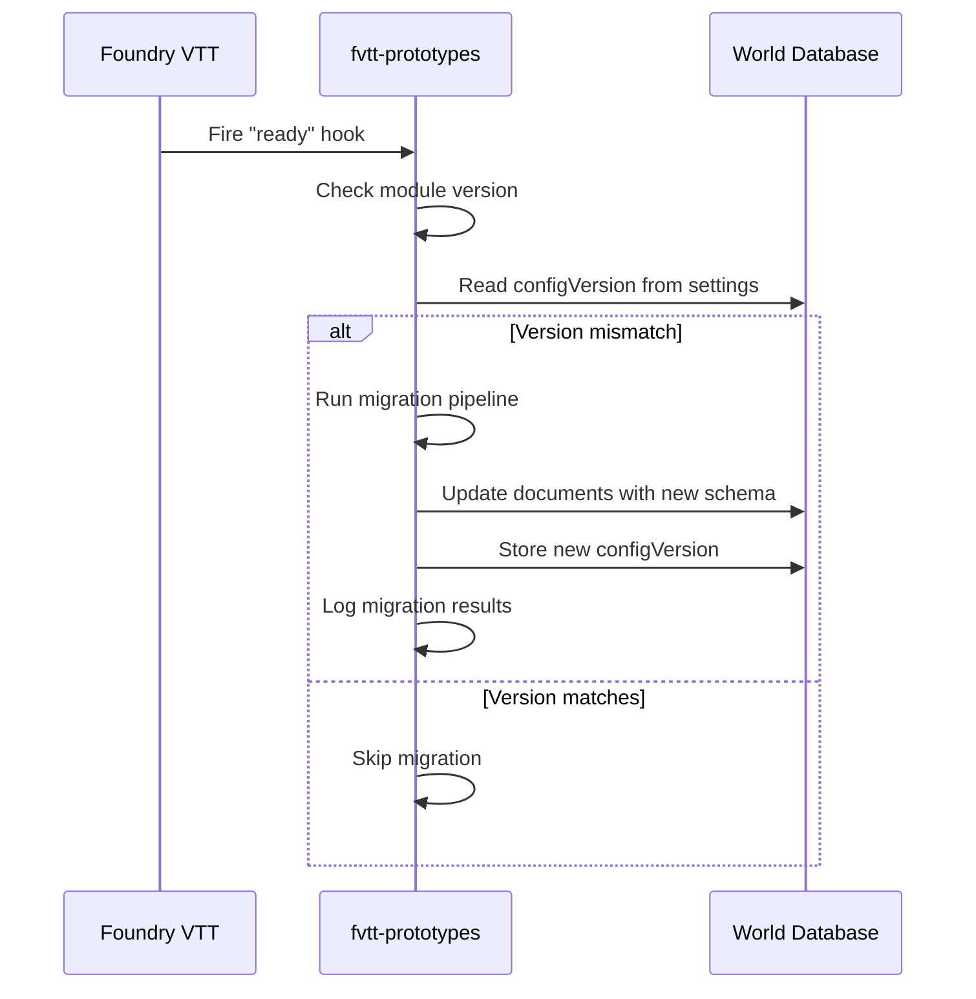

# Database: Data Migration Strategy

> Version-based data migration for flag schemas, cross-version compatibility, and safe rollout procedures.

## Migration Architecture



## Migration Runner

```js
// scripts/migrations/runner.js
import { MODULE_ID } from '../constants.js';
import { log, warn, notifyError } from '../utils/logging.js';
import { migrations } from './index.js';

const CURRENT_SCHEMA_VERSION = 3;

export async function runMigrations() {
  if (!game.user.isGM) return; // Only GM runs migrations

  const storedVersion = game.settings.get(MODULE_ID, 'schemaVersion') ?? 0;

  if (storedVersion >= CURRENT_SCHEMA_VERSION) {
    log(`Schema is current (v${storedVersion}). No migration needed.`);
    return;
  }

  log(`Migrating from schema v${storedVersion} to v${CURRENT_SCHEMA_VERSION}`);
  ui.notifications.info('fvtt-prototypes: Running data migration...');

  for (const migration of migrations) {
    if (migration.version <= storedVersion) continue;

    try {
      log(`Running migration: ${migration.name} (v${migration.version})`);
      await migration.run();
      log(`Completed: ${migration.name}`);
    } catch (err) {
      notifyError(
        `Migration failed: ${migration.name}. Please report this issue.`,
        `Migration v${migration.version} failed`,
        err
      );
      return; // Stop on first failure — don't skip migrations
    }
  }

  await game.settings.set(MODULE_ID, 'schemaVersion', CURRENT_SCHEMA_VERSION);
  ui.notifications.info('fvtt-prototypes: Migration complete.');
  log(`Migration complete. Schema is now v${CURRENT_SCHEMA_VERSION}`);
}
```

### Migration Registry

```js
// scripts/migrations/index.js
import { migrateV1toV2 } from './001-add-config-object.js';
import { migrateV2toV3 } from './002-rename-display-mode.js';

export const migrations = [
  {
    version: 2,
    name: '001-add-config-object',
    run: migrateV1toV2
  },
  {
    version: 3,
    name: '002-rename-display-mode',
    run: migrateV2toV3
  }
];
```

## Writing Migrations

### Example: Adding a Nested Config Object (v1 → v2)

Schema v1 stored `autoRoll` as a top-level flag. Schema v2 nests it under `config`.

```js
// scripts/migrations/001-add-config-object.js
import { MODULE_ID } from '../constants.js';
import { log } from '../utils/logging.js';

export async function migrateV1toV2() {
  const actors = game.actors.filter(a =>
    a.getFlag(MODULE_ID, 'prototypeData') !== undefined
  );

  if (actors.length === 0) return;
  log(`Migrating ${actors.length} actors from schema v1 to v2`);

  for (const actor of actors) {
    const data = actor.getFlag(MODULE_ID, 'prototypeData');

    // Skip if already migrated
    if (data.config !== undefined) continue;

    const updated = {
      ...data,
      config: {
        autoRoll: data.autoRoll ?? false,
        showOverlay: true,
        opacity: 1.0
      }
    };
    delete updated.autoRoll; // Remove old top-level key

    await actor.setFlag(MODULE_ID, 'prototypeData', updated);
  }
}
```

### Example: Renaming a Field (v2 → v3)

Rename `mode` to `displayMode` for clarity.

```js
// scripts/migrations/002-rename-display-mode.js
import { MODULE_ID } from '../constants.js';
import { log } from '../utils/logging.js';

export async function migrateV2toV3() {
  const actors = game.actors.filter(a => {
    const data = a.getFlag(MODULE_ID, 'prototypeData');
    return data?.mode !== undefined && data?.displayMode === undefined;
  });

  if (actors.length === 0) return;
  log(`Migrating ${actors.length} actors from schema v2 to v3`);

  for (const actor of actors) {
    const data = actor.getFlag(MODULE_ID, 'prototypeData');
    const updated = { ...data, displayMode: data.mode };
    delete updated.mode;
    await actor.setFlag(MODULE_ID, 'prototypeData', updated);
  }
}
```

## Migration Registration

Register the schema version setting and hook during module init:

```js
// scripts/settings.js (add to existing registerSettings)
game.settings.register(MODULE_ID, 'schemaVersion', {
  scope: 'world',
  config: false,
  type: Number,
  default: 0
});

// scripts/hooks/ready.js
import { runMigrations } from '../migrations/runner.js';

export async function onReady() {
  await runMigrations();
}
```

## Migration Safety Rules

| Rule | Rationale |
|------|-----------|
| Migrations run only for GM | Prevents race conditions from multiple clients migrating simultaneously |
| Migrations run in order | Each builds on the previous schema version |
| Stop on first failure | Partial migrations leave data in an inconsistent state — better to halt and report |
| Skip already-migrated documents | Check for new schema shape before transforming |
| Log every step | Debugging migration issues requires a clear audit trail |
| Never delete data in migrations | Rename or restructure, but keep old data accessible during the transition period |

## Bulk Update Optimization

For worlds with many documents, batch updates to reduce server round-trips:

```js
async function migrateBulk(actors, transformFn) {
  const updates = [];

  for (const actor of actors) {
    const data = actor.getFlag(MODULE_ID, 'prototypeData');
    const updated = transformFn(data);
    if (updated) {
      updates.push({
        _id: actor.id,
        [`flags.${MODULE_ID}.prototypeData`]: updated
      });
    }
  }

  if (updates.length > 0) {
    // Batch update — single server round-trip
    await Actor.updateDocuments(updates);
    log(`Bulk migrated ${updates.length} actors`);
  }
}
```

## Handling Foundry Version Upgrades

When Foundry itself upgrades (e.g., V11 → V12), the core data structures may change. Module migrations should account for this:

```js
// Check Foundry version before migration logic
const isV12 = game.release.generation >= 12;

if (isV12) {
  // V12 uses ApplicationV2, different data paths
} else {
  // V11 legacy paths
}
```

## Decision History & Trade-offs

### Sequential Migrations vs. Snapshot-Based

**Chosen**: Sequential, version-numbered migrations.
**Why**: Each migration is a small, testable unit. The chain is easy to reason about and debug. Matches patterns familiar from database ORMs (Prisma, Knex, Alembic).
**Trade-off**: Long migration chains for very old installations. Acceptable for a module — document counts are small compared to production databases.

### Per-Document Migration vs. Bulk Transform

**Chosen**: Per-document with optional bulk optimization.
**Why**: Per-document is safer — each document is validated individually, and errors are isolated. Bulk is offered as an optimization for large worlds.
**Trade-off**: Per-document is slower (one server round-trip per document). For worlds with 1,000+ flagged documents, use the bulk pattern.

### GM-Only Migration vs. First-Client Migration

**Chosen**: GM-only.
**Why**: Prevents race conditions. Only one client (the GM) writes migration changes. Other clients receive updates via Foundry's normal document sync.
**Trade-off**: If no GM connects, migration doesn't run. Non-issue in practice — Foundry worlds require a GM to launch.

## Related Documents

| Document | Relevance |
|----------|-----------|
| [schema.md](schema.md) | Document schema that migrations transform |
| [models.md](models.md) | DataModel schemas that define target structure |
| [../guidelines.md](../guidelines.md) | Release workflow including migration testing |
| [../auth/overview.md](../auth/overview.md) | GM permission requirement for migrations |
