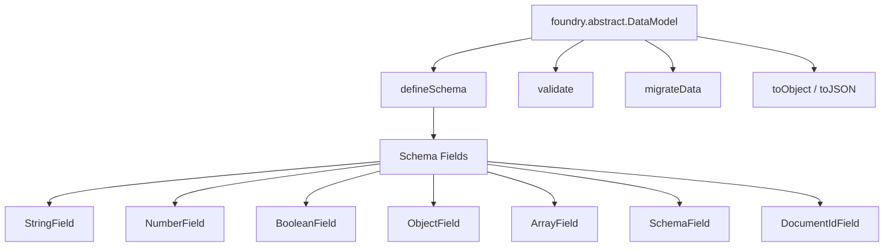

# Database: Data Models & Validation

> Custom DataModel definitions, schema fields, type validation, and data integrity patterns for Foundry VTT.

## DataModel Overview

Foundry's `DataModel` class provides schema-driven validation for structured data. Modules use DataModels to define the shape and constraints of flag data, settings data, or custom document types.



## Defining a Custom DataModel

```js
// scripts/models/PrototypeData.js

const { DataModel } = foundry.abstract;
const fields = foundry.data.fields;

export class PrototypeData extends DataModel {
  static defineSchema() {
    return {
      variant: new fields.StringField({
        required: true,
        blank: true,
        initial: '',
        label: 'FVTT_PROTOTYPES.Fields.Variant',
        hint: 'FVTT_PROTOTYPES.Fields.VariantHint'
      }),
      iterations: new fields.NumberField({
        required: true,
        integer: true,
        positive: true,
        initial: 1,
        min: 1,
        max: 100,
        label: 'FVTT_PROTOTYPES.Fields.Iterations'
      }),
      active: new fields.BooleanField({
        initial: false,
        label: 'FVTT_PROTOTYPES.Fields.Active'
      }),
      displayMode: new fields.StringField({
        required: true,
        initial: 'full',
        choices: ['full', 'compact', 'minimal'],
        label: 'FVTT_PROTOTYPES.Fields.DisplayMode'
      }),
      config: new fields.SchemaField({
        autoRoll: new fields.BooleanField({ initial: false }),
        showOverlay: new fields.BooleanField({ initial: true }),
        opacity: new fields.NumberField({
          initial: 1.0,
          min: 0,
          max: 1,
          step: 0.1
        })
      }),
      tags: new fields.ArrayField(
        new fields.StringField({ blank: false }),
        { initial: [] }
      ),
      notes: new fields.HTMLField({
        initial: '',
        label: 'FVTT_PROTOTYPES.Fields.Notes'
      })
    };
  }
}
```

## Schema Field Reference

| Field Class | JS Type | Key Options |
|------------|---------|-------------|
| `StringField` | `string` | `required`, `blank`, `choices`, `initial` |
| `NumberField` | `number` | `integer`, `positive`, `min`, `max`, `step` |
| `BooleanField` | `boolean` | `initial` |
| `ObjectField` | `object` | Arbitrary object, no nested validation |
| `ArrayField` | `array` | Takes an inner field type for element validation |
| `SchemaField` | `object` | Nested schema with named fields (validated) |
| `HTMLField` | `string` | Sanitized HTML string |
| `FilePathField` | `string` | `categories` (images, audio, etc.) |
| `ColorField` | `string` | CSS color string validation |
| `DocumentIdField` | `string` | 16-char alphanumeric ID |
| `IntegerSortField` | `number` | Sort ordering field |

## Using DataModel with Flags

### Registering the Model

```js
// scripts/hooks/init.js
import { MODULE_ID } from '../constants.js';
import { PrototypeData } from '../models/PrototypeData.js';

export function onInit() {
  // Make the model available globally for other modules
  game.modules.get(MODULE_ID).dataModels = { PrototypeData };
}
```

### Validating Flag Data

```js
import { PrototypeData } from '../models/PrototypeData.js';
import { notifyError } from '../utils/logging.js';

/**
 * Get validated prototype data from an actor's flags.
 * Returns a PrototypeData instance with defaults applied.
 */
function getPrototypeData(actor) {
  const raw = actor.getFlag('fvtt-prototypes', 'prototypeData') ?? {};
  try {
    return new PrototypeData(raw);
  } catch (err) {
    notifyError(
      `Invalid prototype data on ${actor.name}.`,
      'DataModel validation failed',
      err
    );
    return new PrototypeData({}); // Return defaults
  }
}

/**
 * Save validated prototype data to an actor's flags.
 */
async function setPrototypeData(actor, data) {
  const model = new PrototypeData(data);
  await actor.setFlag('fvtt-prototypes', 'prototypeData', model.toObject());
}
```

### Validation Error Handling

DataModel constructors throw on invalid data. Catch and handle gracefully:

```js
try {
  const model = new PrototypeData({
    iterations: -5,       // Fails: positive constraint
    displayMode: 'invalid' // Fails: not in choices
  });
} catch (err) {
  // err.message contains field-level validation details
  console.error('Validation errors:', err.message);
}
```

## Advanced Patterns

### DataModel with Computed Properties

```js
export class PrototypeData extends DataModel {
  static defineSchema() {
    return {
      variant: new fields.StringField({ initial: '' }),
      iterations: new fields.NumberField({ initial: 1, integer: true }),
      createdAt: new fields.NumberField({ initial: () => Date.now() })
    };
  }

  // Computed property — not stored, derived from schema data
  get displayName() {
    return this.variant || `Unnamed (${this.iterations} iterations)`;
  }

  // Business logic method
  isComplete() {
    return this.variant !== '' && this.iterations > 0;
  }
}
```

### Nested SchemaField for Complex Structures

```js
static defineSchema() {
  return {
    metadata: new fields.SchemaField({
      author: new fields.StringField({ required: true }),
      version: new fields.NumberField({ initial: 1, integer: true }),
      lastModified: new fields.NumberField({ initial: () => Date.now() })
    }),
    coordinates: new fields.SchemaField({
      x: new fields.NumberField({ required: true, initial: 0 }),
      y: new fields.NumberField({ required: true, initial: 0 }),
      rotation: new fields.NumberField({ initial: 0, min: 0, max: 360 })
    })
  };
}
```

### ArrayField with Object Elements

```js
static defineSchema() {
  return {
    waypoints: new fields.ArrayField(
      new fields.SchemaField({
        label: new fields.StringField({ required: true }),
        x: new fields.NumberField({ required: true }),
        y: new fields.NumberField({ required: true }),
        active: new fields.BooleanField({ initial: true })
      })
    )
  };
}
```

## Type Safety with JSDoc

Add type annotations for IntelliSense without TypeScript compilation:

```js
/**
 * @typedef {object} PrototypeDataSchema
 * @property {string} variant
 * @property {number} iterations
 * @property {boolean} active
 * @property {'full'|'compact'|'minimal'} displayMode
 * @property {{ autoRoll: boolean, showOverlay: boolean, opacity: number }} config
 * @property {string[]} tags
 * @property {string} notes
 */

/**
 * @param {Actor} actor
 * @returns {PrototypeDataSchema}
 */
function getPrototypeDataPlain(actor) {
  return actor.getFlag('fvtt-prototypes', 'prototypeData') ?? {};
}
```

## Decision History & Trade-offs

### DataModel vs. Plain Object Validation

**Chosen**: DataModel for structured flag data.
**Why**: Provides declarative schema definition, automatic defaults, type coercion, constraint validation, and migration support. Integrates natively with Foundry's form handling.
**Trade-off**: Adds a class per data structure. For simple key-value flags (single boolean/string), a plain `getFlag`/`setFlag` is sufficient — DataModel is overkill.

### Schema-Driven Defaults vs. Application-Layer Defaults

**Chosen**: Defaults defined in the DataModel schema (`initial` property).
**Why**: Single source of truth. Whether data is read from flags, constructed in code, or populated in a form, the same defaults apply.
**Trade-off**: Runtime defaults cannot vary per context. If defaults depend on game system or world settings, use `initial` as a factory function: `initial: () => computeDefault()`.

## Related Documents

| Document | Relevance |
|----------|-----------|
| [schema.md](schema.md) | Document structure where models validate flag data |
| [migrations.md](migrations.md) | Migrating model schemas across versions |
| [../api/endpoints.md](../api/endpoints.md) | How validated data is read/written via APIs |
| [../ui/patterns.md](../ui/patterns.md) | Form binding with DataModel instances |
