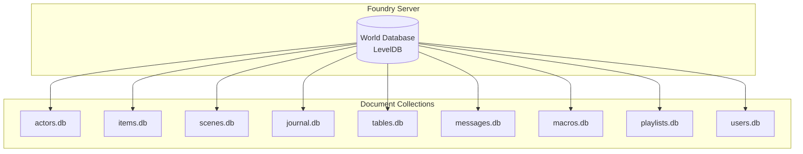
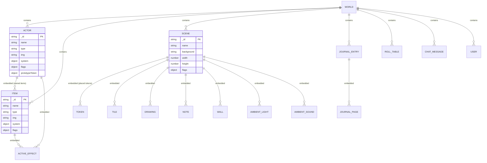

# Database: Foundry Document Schema

> Foundry's document-oriented data model, entity relationships, storage architecture, and schema design for module data.

## Storage Architecture

Foundry VTT uses a document-oriented database, not a relational one. Each World stores documents in flat-file databases (NeDB in V11, LevelDB in V12+).



## Document Hierarchy



## Module Data via Flags

Modules store data on documents using the Flags API. Flags are stored in the `flags` object, namespaced by module ID.

### Flag Storage Structure

```json
{
  "_id": "abc123",
  "name": "Test Actor",
  "type": "character",
  "system": { },
  "flags": {
    "fvtt-prototypes": {
      "prototypeData": {
        "variant": "alpha",
        "iterations": 3,
        "config": {
          "autoRoll": true,
          "displayMode": "compact"
        }
      },
      "configVersion": 2
    }
  }
}
```

### Structured Flag Schema

Define the expected shape of flag data for documentation and validation:

| Flag Key | Type | Default | Description |
|----------|------|---------|-------------|
| `prototypeData` | `object` | `{}` | Primary module data container |
| `prototypeData.variant` | `string` | `''` | Named variant identifier |
| `prototypeData.iterations` | `number` | `1` | Number of prototype iterations |
| `prototypeData.config` | `object` | `{}` | User-configurable options |
| `prototypeData.config.autoRoll` | `boolean` | `false` | Auto-roll on prototype activation |
| `prototypeData.config.displayMode` | `string` | `'full'` | UI display mode: `full`, `compact`, `minimal` |
| `configVersion` | `number` | `1` | Schema version for migration tracking |

## Settings Storage

Settings registered via `game.settings.register()` are stored separately from document flags:

| Scope | Storage Location | Accessible By |
|-------|-----------------|---------------|
| `world` | World settings database | All clients (GM write, all read) |
| `client` | Browser localStorage | Current client only |

```js
// World setting — stored server-side
game.settings.get('fvtt-prototypes', 'enableFeature');

// Client setting — stored in browser
game.settings.get('fvtt-prototypes', 'sidebarPosition');
```

## Indexing & Query Patterns

Foundry does not support arbitrary database queries. All data access is through in-memory collections loaded at world startup.

### Searching Collections

```js
// Find by ID (O(1) — hash map lookup)
const actor = game.actors.get('abc123');

// Find by name (O(n) — linear scan)
const actor = game.actors.getName('Test Actor');

// Filter with predicate (O(n) — linear scan)
const npcs = game.actors.filter(a => a.type === 'npc');

// Find actors with specific flag data
const prototyped = game.actors.filter(a =>
  a.getFlag('fvtt-prototypes', 'prototypeData') !== undefined
);
```

### Performance: Collection Sizes

| Collection | Typical Size | Large World | Access Pattern |
|-----------|-------------|-------------|----------------|
| Actors | 50-200 | 1,000+ | Frequent reads, rare writes |
| Items | 100-500 | 5,000+ | Frequent reads, rare writes |
| Scenes | 10-50 | 200+ | Infrequent reads |
| Chat Messages | 100-1,000 | 10,000+ | Append-heavy, rarely queried |
| Journal Entries | 20-100 | 500+ | Infrequent reads |

For large collections, prefer `game.actors.get(id)` over `game.actors.filter()` when possible.

## Embedded Documents

Some documents contain other documents as embedded collections:

```js
// Access embedded items on an actor
const actor = game.actors.get('abc123');
const ownedItems = actor.items;          // EmbeddedCollection
const sword = actor.items.getName('Longsword');

// Create an embedded item
await actor.createEmbeddedDocuments('Item', [{
  name: 'Prototype Gadget',
  type: 'equipment',
  flags: { 'fvtt-prototypes': { isPrototype: true } }
}]);

// Update an embedded item
await actor.updateEmbeddedDocuments('Item', [{
  _id: sword.id,
  'flags.fvtt-prototypes.prototypeData': { enhanced: true }
}]);

// Delete embedded items
await actor.deleteEmbeddedDocuments('Item', [sword.id]);
```

## Decision History & Trade-offs

### Flags vs. Extending system Data

**Chosen**: Flags for all module-specific data.
**Why**: The `system` object is owned by the game system (e.g., dnd5e). Modules should never write to `system` directly — it risks data corruption and conflicts with the system's own data management.
**Trade-off**: Flags are not visible in default sheet UIs. Module must inject its own UI to display flag data.

### Flat Flags vs. Nested Objects

**Chosen**: Single nested object under one flag key (`prototypeData`).
**Why**: Grouping related data under one key reduces the number of top-level flag entries and makes it easier to read/delete all module data atomically.
**Trade-off**: Partial updates require dot-notation paths (`prototypeData.config.autoRoll`). Deeply nested updates can be verbose.

### Schema Version Tracking

**Chosen**: Store `configVersion` flag alongside data.
**Why**: Enables forward-compatible data migrations when the flag schema changes between module versions. See `migrations.md` for the migration runner.
**Trade-off**: Adds one extra flag key per document. Negligible storage cost.

## Related Documents

| Document | Relevance |
|----------|-----------|
| [models.md](models.md) | DataModel validation for flag schemas |
| [migrations.md](migrations.md) | Version-based data migration strategy |
| [../api/endpoints.md](../api/endpoints.md) | Document CRUD API reference |
| [../auth/overview.md](../auth/overview.md) | Permission model for document access |
