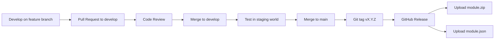

# Development Guidelines

> Git workflow, coding standards, testing strategy, code review, deployment procedures, and release management.

## Git Workflow

### Branch Strategy

```mermaid
gitgraph
    commit id: "v1.0.0"
    branch develop
    checkout develop
    commit id: "feat: add config panel"
    commit id: "fix: handle null flags"
    branch feature/socket-sync
    checkout feature/socket-sync
    commit id: "feat: socket dispatcher"
    commit id: "test: socket handler"
    checkout develop
    merge feature/socket-sync
    checkout main
    merge develop tag: "v1.1.0"
    checkout develop
    commit id: "feat: canvas overlay"
```

| Branch | Purpose | Merges Into |
|--------|---------|-------------|
| `main` | Stable releases. Each merge tagged with a version. | — |
| `develop` | Integration branch. Features merge here first. | `main` |
| `feature/*` | Individual features or fixes. | `develop` |
| `hotfix/*` | Critical production fixes. | `main` and `develop` |

### Branch Naming

```
feature/add-prototype-config
feature/socket-sync
fix/null-flag-handling
hotfix/migration-crash
docs/update-architecture
chore/update-dependencies
```

### Commit Messages

Follow Conventional Commits format:

```
<type>(<scope>): <description>

[optional body]

[optional footer]
```

| Type | Usage |
|------|-------|
| `feat` | New feature or capability |
| `fix` | Bug fix |
| `docs` | Documentation only |
| `style` | Formatting, no logic change |
| `refactor` | Code restructuring, no behavior change |
| `test` | Adding or updating tests |
| `chore` | Build, CI, dependency updates |

Examples:

```
feat(settings): add debug mode dropdown setting
fix(migration): handle actors with missing flag data
docs(architecture): add Mermaid sequence diagram for lifecycle
refactor(socket): extract action dispatcher to separate module
chore(deps): update vite to 6.1.0
```

## Coding Standards

### JavaScript Style

```js
// Use const by default, let when reassignment is needed
const MODULE_ID = 'fvtt-prototypes';
let currentState = null;

// Use arrow functions for callbacks
Hooks.on('ready', () => {
  initializeModule();
});

// Use template literals over string concatenation
const message = `Module ${MODULE_ID} initialized in ${Date.now() - start}ms`;

// Use optional chaining and nullish coalescing
const variant = actor.getFlag(MODULE_ID, 'prototypeData')?.variant ?? 'default';

// Use destructuring for function parameters
function renderPanel({ variant, iterations, displayMode }) {
  // ...
}

// Use async/await over .then() chains
async function saveData(actor, data) {
  await actor.setFlag(MODULE_ID, 'prototypeData', data);
  ui.notifications.info('Saved.');
}
```

### File Organization Rules

1. One class per file. File name matches class name in kebab-case.
2. Constants at the top, exports at the bottom.
3. Private methods prefixed with `#` (ES2022 private class fields).
4. Group imports: Foundry globals first, then local modules.

```js
// Foundry globals (no import needed, but document for clarity)
// Hooks, game, canvas, ui — available globally

// Local imports
import { MODULE_ID, FLAGS } from '../constants.js';
import { log, notifyError } from '../utils/logging.js';
import { canEditPrototypeData } from '../utils/permissions.js';
```

## Testing Strategy

### Manual Testing Protocol

Since no automated test framework is configured, follow this structured manual testing protocol:

#### Pre-Release Checklist

| Test | Steps | Expected Result |
|------|-------|----------------|
| Module loads | Enable module, check console | No errors, init message logged |
| Settings register | Open module settings | All settings appear with correct defaults |
| Flag read/write | Set flag via console, reload | Flag persists across reload |
| Sheet injection | Open actor sheet | Custom tab appears with correct data |
| Permission gating | Login as Player | Edit controls hidden, view-only visible |
| Socket sync | Two browser tabs open | State changes propagate to second tab |
| Migration | Set old schema version, reload | Migration runs, data transformed correctly |

#### Console Testing Commands

```js
// Verify module loaded
game.modules.get('fvtt-prototypes')?.active

// Test flag operations
const actor = game.actors.contents[0];
await actor.setFlag('fvtt-prototypes', 'prototypeData', { variant: 'test', iterations: 5 });
actor.getFlag('fvtt-prototypes', 'prototypeData');

// Test settings
game.settings.get('fvtt-prototypes', 'enableFeature');
await game.settings.set('fvtt-prototypes', 'enableFeature', true);

// Test socket (open two browser tabs)
game.socket.emit('module.fvtt-prototypes', { action: 'ping', payload: Date.now(), userId: game.user.id });
```

### Future: Automated Testing with Quench

When automated testing is needed, use the [Quench](https://github.com/Ethaks/FVTT-Quench) module — a test runner that executes inside Foundry's runtime:

```js
// scripts/tests/prototype-data.test.js
Hooks.on('quenchReady', (quench) => {
  quench.registerBatch('fvtt-prototypes.models', (context) => {
    const { describe, it, expect } = context;

    describe('PrototypeData', () => {
      it('should apply default values', () => {
        const data = new PrototypeData({});
        expect(data.variant).to.equal('');
        expect(data.iterations).to.equal(1);
      });

      it('should reject negative iterations', () => {
        expect(() => new PrototypeData({ iterations: -1 })).to.throw();
      });
    });
  });
});
```

## Code Review Guidelines

### Review Checklist

- [ ] Module ID prefix used consistently in CSS classes, flags, settings, and hooks
- [ ] Permission checks at both UI and data layers
- [ ] Error handling with `notifyError()` in all hook callbacks
- [ ] Localization keys used instead of hardcoded strings
- [ ] `module.json` updated if new scripts, styles, or languages added
- [ ] No direct writes to `document.system` (use flags instead)
- [ ] Socket handlers validate sender permissions
- [ ] Templates use Handlebars auto-escaping (no triple-braces on user input)

## Deployment Procedures

### Local Development

```bash
# 1. Clone the repository
git clone https://github.com/your-username/fvtt-prototypes.git

# 2. Symlink into Foundry's modules directory
ln -s /path/to/fvtt-prototypes /path/to/foundry/Data/modules/fvtt-prototypes

# 3. Start Foundry VTT and enable the module
# 4. Edit source files — Foundry reloads on browser refresh
```

### With Vite (for npm dependencies or TypeScript)

```bash
# 1. Install dependencies
npm install

# 2. Development mode with HMR
npm run dev

# 3. Production build
npm run build

# 4. Symlink dist/ to Foundry's modules directory
ln -s /path/to/fvtt-prototypes/dist /path/to/foundry/Data/modules/fvtt-prototypes
```

### Release Process



#### Step-by-Step Release

```bash
# 1. Merge develop into main
git checkout main
git merge develop

# 2. Update version in module.json
# Bump "version" and "download" URL

# 3. Build if using Vite
npm run build

# 4. Create release archive
zip -r module.zip module.json scripts/ styles/ templates/ languages/

# 5. Tag and push
git tag v1.1.0
git push origin main --tags

# 6. Create GitHub Release
# Upload module.zip and module.json as release assets

# 7. Verify manifest URL resolves
curl -s https://github.com/your-username/fvtt-prototypes/releases/latest/download/module.json | jq .version
```

## Performance Monitoring

### Browser DevTools Profiling

```js
// Measure hook execution time
Hooks.on('renderActorSheet', (app, html, data) => {
  const start = performance.now();
  onRenderActorSheet(app, html, data);
  const elapsed = performance.now() - start;
  if (elapsed > 5) {
    console.warn(`fvtt-prototypes | Slow render hook: ${elapsed.toFixed(1)}ms`);
  }
});
```

### Performance Budgets

| Metric | Budget | Measured How |
|--------|--------|-------------|
| Hook callback execution | < 5ms | `performance.now()` |
| Application render | < 50ms | DevTools Performance panel |
| Socket message size | < 1KB | `JSON.stringify(payload).length` |
| Module CSS file size | < 20KB | File size on disk |
| Total module JS size | < 100KB | Vite build output |

## Decision History & Trade-offs

### Conventional Commits vs. Free-Form Messages

**Chosen**: Conventional Commits.
**Why**: Enables automated changelog generation, makes commit history scannable, and enforces discipline in commit granularity.
**Trade-off**: Slightly more effort per commit. Worth it for any project with more than one contributor or long maintenance periods.

### Symlink Development vs. Build-First

**Chosen**: Symlink as default, Vite when needed.
**Why**: Zero-friction development for pure JS. Edit, save, refresh. Adding Vite is an opt-in step when npm packages or TypeScript are introduced.
**Trade-off**: Symlink mode cannot use npm packages or TypeScript. Acceptable for prototyping — upgrade to Vite when the project matures.

### Manual Testing vs. Automated from Day One

**Chosen**: Manual testing with structured protocol, automated testing deferred to Quench.
**Why**: Foundry module tests must run inside Foundry's runtime — standard Node.js test runners cannot load Foundry APIs. Quench provides in-Foundry testing but adds a module dependency. Manual testing with a structured checklist is sufficient for early development.
**Trade-off**: Higher risk of regression as the codebase grows. Introduce Quench when the module reaches 10+ features or has multiple contributors.

## Related Documents

| Document | Relevance |
|----------|-----------|
| [substrate.md](substrate.md) | Project identity and conventions |
| [architecture/overview.md](architecture/overview.md) | Build pipeline and architecture |
| [architecture/dependencies.md](architecture/dependencies.md) | npm and Vite configuration |
| [seo/overview.md](seo/overview.md) | Release publishing and discoverability |
