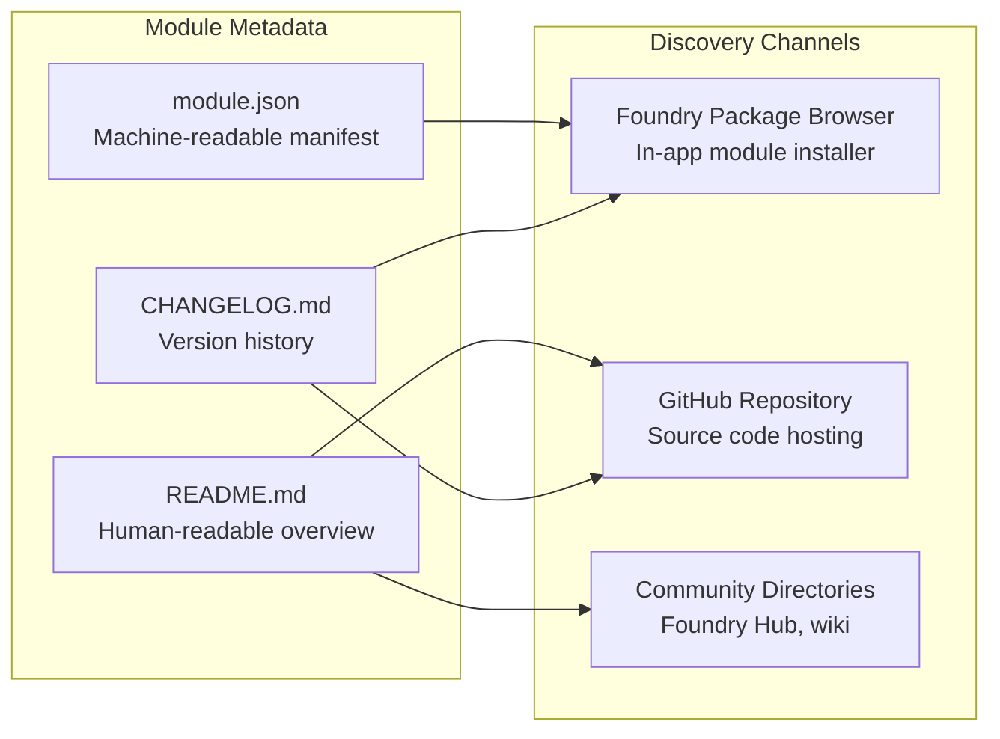
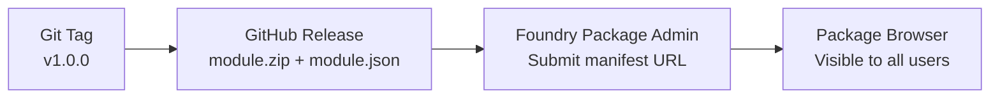

# SEO: Module Discoverability & Metadata

> Module listing optimization, manifest metadata, package browser presence, and community discoverability for Foundry VTT modules.

## Discoverability Architecture

Unlike web applications, Foundry VTT modules are discovered through three primary channels:



## Package Browser Optimization

Foundry's built-in package browser is how most users discover modules. The manifest fields directly control what appears in search results.

### Manifest Fields That Affect Discovery

```json
{
  "id": "fvtt-prototypes",
  "title": "FVTT Prototypes",
  "description": "Prototype and experiment with custom VTT functionality. Add custom data to actors and items, synchronize state across clients, and test new UI patterns — all without modifying game system files.",
  "version": "1.0.0",
  "compatibility": {
    "minimum": "12",
    "verified": "12"
  },
  "authors": [
    {
      "name": "Your Name",
      "url": "https://github.com/your-username",
      "discord": "username#0000"
    }
  ],
  "url": "https://github.com/your-username/fvtt-prototypes",
  "readme": "https://github.com/your-username/fvtt-prototypes/blob/main/README.md",
  "bugs": "https://github.com/your-username/fvtt-prototypes/issues"
}
```

### Description Best Practices

| Practice | Example |
|----------|---------|
| Lead with what the module does | "Prototype and experiment with custom VTT functionality." |
| Mention key features | "Add custom data to actors and items, synchronize state across clients" |
| Include searchable keywords naturally | "UI patterns", "custom data", "synchronize" |
| State compatibility clearly | "Requires Foundry VTT V12+" |
| Keep under 300 characters | Foundry truncates long descriptions in the browser |

### Title Guidelines

- Use title case: "FVTT Prototypes" not "fvtt-prototypes"
- Keep under 40 characters for full display in narrow UI panels
- Avoid prefixing with "Foundry" or "Module" — the context is obvious in the package browser
- Include the most distinctive word first for alphabetical browsing

## GitHub Repository Optimization

### README Structure

A well-structured README improves GitHub discoverability and serves as the primary landing page.

```markdown
# FVTT Prototypes


> Prototype and experiment with custom VTT functionality in Foundry VTT.

## Features

- Custom data storage on actors, items, and scenes
- Real-time state synchronization across clients
- Configurable UI panels with multiple display modes
- Permission-aware controls (GM vs. player views)

## Installation

1. Open Foundry VTT
2. Go to **Settings** > **Manage Modules** > **Install Module**
3. Search for "FVTT Prototypes" or paste this manifest URL:

`https://github.com/your-username/fvtt-prototypes/releases/latest/download/module.json`

## Compatibility

| Foundry VTT | Module Version |
|------------|---------------|
| V12        | 1.x           |

## Screenshots

[Include 2-3 screenshots showing key module features]
```

### GitHub Topics

Add relevant topics to the repository for GitHub search:

```
foundry-vtt, foundry-vtt-module, fvtt, tabletop-rpg, virtual-tabletop
```

### Release Strategy for Discoverability



1. Tag the release: `git tag v1.0.0`
2. Create a GitHub Release with `module.json` and `module.zip` as assets
3. Submit the manifest URL to Foundry's Package Administration site
4. Foundry indexes the manifest and the module appears in the package browser

### Manifest URL Pattern

```
# "Latest" manifest URL — always points to the newest release
https://github.com/your-username/fvtt-prototypes/releases/latest/download/module.json

# Versioned download URL — points to a specific release
https://github.com/your-username/fvtt-prototypes/releases/download/v1.0.0/module.zip
```

The `manifest` field should always use the `/latest/` URL so Foundry can detect updates. The `download` field should point to the specific version's zip.

## Community Directory Listings

### Foundry Hub

Submit the module to [foundryvtt-hub.com](https://foundryvtt-hub.com) for additional visibility:

- Write a detailed module description (500+ words)
- Include screenshots and feature highlights
- Tag with relevant categories (utility, UI, automation)
- Respond to user reviews and questions

### Foundry VTT Wiki

Add an entry to the community wiki's module listing with a brief description and link to the repository.

## Analytics & Tracking

Track adoption without invasive telemetry:

| Metric | Source | How to Access |
|--------|--------|---------------|
| Downloads | GitHub Releases | Release page download counts |
| Stars | GitHub | Repository star count |
| Install count | Foundry Package Admin | Admin dashboard (after submission) |
| Issues | GitHub Issues | Issue tracker activity |

## Decision History & Trade-offs

### Foundry Package Browser vs. Self-Hosted

**Chosen**: Publish through Foundry's official package browser.
**Why**: The package browser is the default discovery mechanism for 90%+ of Foundry users. Self-hosted modules require manual manifest URL entry — a significant friction barrier.
**Trade-off**: Requires submitting to Foundry's package administration, which involves a review process. Worth the wait for visibility.

### GitHub Releases vs. Custom CDN

**Chosen**: GitHub Releases for hosting module assets.
**Why**: Free, reliable, supports the standard manifest URL pattern, and integrates with Foundry's update detection. No infrastructure to maintain.
**Trade-off**: GitHub has rate limits on release asset downloads. For extremely popular modules (10,000+ installs), a CDN mirror may be needed. Not a concern at our scale.

## Related Documents

| Document | Relevance |
|----------|-----------|
| [../api/headers.md](../api/headers.md) | Module manifest field reference |
| [../guidelines.md](../guidelines.md) | Release workflow and versioning |
| [../architecture/overview.md](../architecture/overview.md) | Build pipeline for release artifacts |
