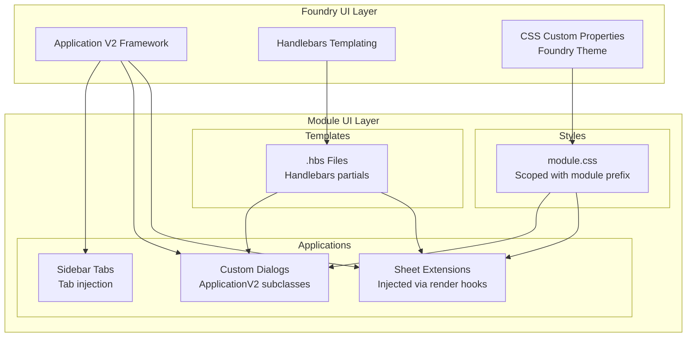
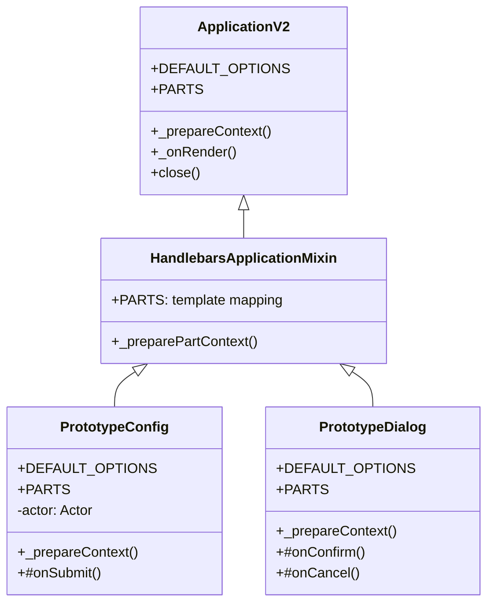

# UI: Component Architecture & Design System

> Application V2 framework, design tokens, component hierarchy, and visual specifications for Foundry VTT module UI.

## UI Architecture



## Design Tokens

Foundry VTT exposes CSS custom properties for theming. Module styles should reference these tokens to remain consistent with the user's chosen UI theme.

### Foundry Core Tokens

```css
/* Colors — reference Foundry's theme */
--color-text-dark-primary       /* Primary text */
--color-text-dark-secondary     /* Secondary text */
--color-text-light-highlight    /* Highlighted text on dark bg */
--color-border-dark-primary     /* Standard borders */
--color-border-highlight        /* Focused/active borders */
--color-shadow-primary          /* Box shadows */
--color-bg-option               /* Background for option rows */
--color-underline-header        /* Header underline accent */

/* Layout */
--sidebar-width                 /* Sidebar panel width */
--sidebar-header-height         /* Sidebar tab header */

/* Typography */
--font-primary                  /* "Signika", sans-serif */
--font-size-base                /* Base font size */
```

### Module-Specific Tokens

Define module tokens that extend Foundry's theme:

```css
/* styles/module.css */
:root {
  --fvtt-proto-accent: #7b68ee;
  --fvtt-proto-accent-hover: #6a5acd;
  --fvtt-proto-panel-bg: rgba(0, 0, 0, 0.05);
  --fvtt-proto-panel-border: var(--color-border-dark-primary);
  --fvtt-proto-panel-radius: 4px;
  --fvtt-proto-spacing-sm: 4px;
  --fvtt-proto-spacing-md: 8px;
  --fvtt-proto-spacing-lg: 16px;
  --fvtt-proto-transition: 0.2s ease;
}
```

## Component Hierarchy

### Application V2 Class Structure



### Application V2 Implementation

```js
// scripts/apps/PrototypeConfig.js
const { ApplicationV2, HandlebarsApplicationMixin } = foundry.applications.api;

export class PrototypeConfig extends HandlebarsApplicationMixin(ApplicationV2) {

  static DEFAULT_OPTIONS = {
    id: 'fvtt-prototypes-config-{id}',
    classes: ['fvtt-prototypes--app'],
    tag: 'form',
    form: {
      handler: PrototypeConfig.#onSubmit,
      submitOnChange: false,
      closeOnSubmit: true
    },
    position: {
      width: 520,
      height: 'auto'
    },
    window: {
      title: 'FVTT_PROTOTYPES.Config.Title',
      icon: 'fas fa-flask',
      resizable: true
    },
    actions: {
      resetDefaults: PrototypeConfig.#onResetDefaults
    }
  };

  static PARTS = {
    header: { template: 'modules/fvtt-prototypes/templates/config-header.hbs' },
    form: { template: 'modules/fvtt-prototypes/templates/config-form.hbs' },
    footer: { template: 'modules/fvtt-prototypes/templates/config-footer.hbs' }
  };

  #actor;

  constructor(actor, options = {}) {
    super(options);
    this.#actor = actor;
  }

  get title() {
    return game.i18n.format('FVTT_PROTOTYPES.Config.TitleWithName', {
      name: this.#actor.name
    });
  }

  async _prepareContext(options) {
    const flagData = this.#actor.getFlag('fvtt-prototypes', 'prototypeData') ?? {};
    return {
      actor: this.#actor,
      variant: flagData.variant ?? '',
      iterations: flagData.iterations ?? 1,
      displayMode: flagData.displayMode ?? 'full',
      displayModes: {
        full: 'FVTT_PROTOTYPES.DisplayMode.Full',
        compact: 'FVTT_PROTOTYPES.DisplayMode.Compact',
        minimal: 'FVTT_PROTOTYPES.DisplayMode.Minimal'
      },
      isGM: game.user.isGM,
      canEdit: this.#actor.isOwner
    };
  }

  static async #onSubmit(event, form, formData) {
    const data = foundry.utils.expandObject(formData.object);
    await this.#actor.setFlag('fvtt-prototypes', 'prototypeData', data);
    ui.notifications.info(game.i18n.localize('FVTT_PROTOTYPES.Config.Saved'));
  }

  static async #onResetDefaults(event, target) {
    await this.#actor.unsetFlag('fvtt-prototypes', 'prototypeData');
    this.render();
  }
}
```

## CSS Architecture

### BEM Naming with Module Prefix

```css
/* Block: module-prefixed top-level component */
.fvtt-prototypes--panel { }

/* Element: child within the block */
.fvtt-prototypes--panel__header { }
.fvtt-prototypes--panel__content { }
.fvtt-prototypes--panel__footer { }

/* Modifier: variant or state */
.fvtt-prototypes--panel--compact { }
.fvtt-prototypes--panel--collapsed { }
.fvtt-prototypes--panel__header--active { }
```

### Complete Component Stylesheet

```css
/* styles/module.css */

/* Panel component */
.fvtt-prototypes--panel {
  background: var(--fvtt-proto-panel-bg);
  border: 1px solid var(--fvtt-proto-panel-border);
  border-radius: var(--fvtt-proto-panel-radius);
  padding: var(--fvtt-proto-spacing-md);
  margin: var(--fvtt-proto-spacing-md) 0;
}

.fvtt-prototypes--panel__header {
  display: flex;
  align-items: center;
  justify-content: space-between;
  padding-bottom: var(--fvtt-proto-spacing-sm);
  border-bottom: 1px solid var(--color-underline-header);
  margin-bottom: var(--fvtt-proto-spacing-md);
}

.fvtt-prototypes--panel__header h3 {
  margin: 0;
  font-family: var(--font-primary);
  font-size: 1rem;
}

.fvtt-prototypes--panel__content {
  display: flex;
  flex-direction: column;
  gap: var(--fvtt-proto-spacing-sm);
}

/* Compact variant */
.fvtt-prototypes--panel--compact {
  padding: var(--fvtt-proto-spacing-sm);
}

.fvtt-prototypes--panel--compact .fvtt-prototypes--panel__header {
  padding-bottom: 2px;
  margin-bottom: var(--fvtt-proto-spacing-sm);
}

/* Button styling */
.fvtt-prototypes--btn {
  background: var(--fvtt-proto-accent);
  color: var(--color-text-light-highlight);
  border: none;
  border-radius: var(--fvtt-proto-panel-radius);
  padding: var(--fvtt-proto-spacing-sm) var(--fvtt-proto-spacing-md);
  cursor: pointer;
  transition: background var(--fvtt-proto-transition);
}

.fvtt-prototypes--btn:hover {
  background: var(--fvtt-proto-accent-hover);
}

.fvtt-prototypes--btn:disabled {
  opacity: 0.5;
  cursor: not-allowed;
}
```

## Accessibility

Foundry VTT modules should follow WCAG 2.1 AA standards where possible:

| Requirement | Implementation |
|------------|----------------|
| Keyboard navigation | All interactive elements focusable via Tab |
| Focus indicators | Use `outline` or `box-shadow` on `:focus-visible` |
| ARIA labels | Add `aria-label` to icon-only buttons |
| Color contrast | 4.5:1 ratio for text, 3:1 for large text |
| Screen reader text | Use `.sr-only` class for visually hidden labels |

```css
/* Visually hidden but screen-reader accessible */
.fvtt-prototypes--sr-only {
  position: absolute;
  width: 1px;
  height: 1px;
  padding: 0;
  margin: -1px;
  overflow: hidden;
  clip: rect(0, 0, 0, 0);
  white-space: nowrap;
  border: 0;
}
```

## Decision History & Trade-offs

### Application V2 vs. Legacy Application

**Chosen**: Application V2 for all new UI components.
**Why**: V2 provides multi-part rendering, built-in form handling, declarative actions, and proper lifecycle management. Foundry is actively developing V2 and deprecating legacy Application.
**Trade-off**: V2 has less community documentation and fewer existing examples. The patterns in this document serve as the canonical reference for this module.

### BEM + Module Prefix vs. CSS Modules / Shadow DOM

**Chosen**: BEM naming with module ID prefix.
**Why**: Foundry's UI is a single DOM — no Shadow DOM boundaries. CSS Modules require a build step. BEM with a unique prefix provides sufficient scoping without tooling overhead.
**Trade-off**: Verbose class names (`.fvtt-prototypes--panel__header--active`). Acceptable — clarity and collision avoidance outweigh brevity.

### Foundry Theme Tokens vs. Custom Design System

**Chosen**: Extend Foundry's CSS custom properties with module-specific tokens.
**Why**: Respects the user's chosen Foundry theme. Module UI looks native rather than foreign. Custom tokens layer on top for module-specific accents.
**Trade-off**: Limited control over base appearance. Module UI will change when users switch Foundry themes — this is a feature, not a bug.

## Related Documents

| Document | Relevance |
|----------|-----------|
| [patterns.md](patterns.md) | UI implementation patterns for forms, dialogs, data display |
| [../architecture/overview.md](../architecture/overview.md) | Application layer in the architecture stack |
| [../api/examples.md](../api/examples.md) | Complete Application V2 code examples |
| [../auth/integration.md](../auth/integration.md) | Permission-aware rendering patterns |
